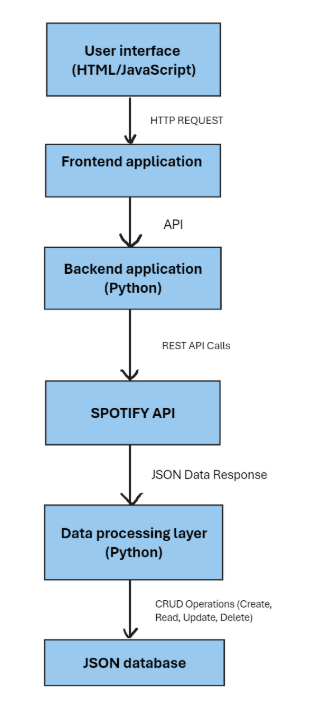
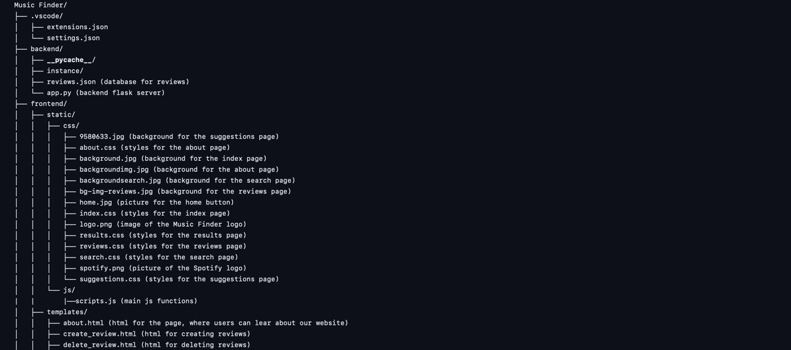
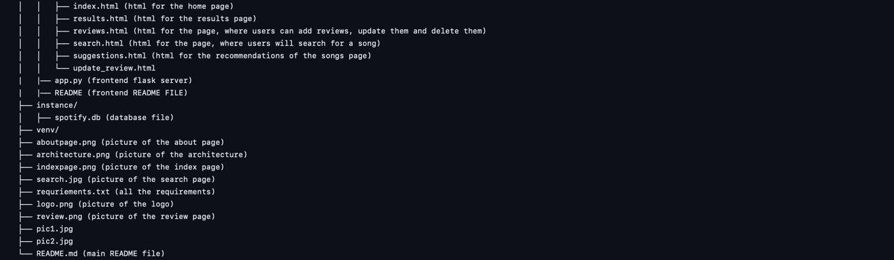

=======
# Music Finder

## Brief description of the project
Welcome to **Music Finder** – the ultimate destination for discovering music perfectly tailored to your tastes. Our platform provides personalized song recommendations based on your searches, ensuring you always find new music you'll love.

Key features include:
- **Personalized Recommendations**: Discover new music based on the songs you search for.
- **Review System**: Add, update, and delete reviews for your favorite tracks. 

## Frontend 

## Team members
**Aleksandra Anna Zdanowicz (azd202)** 
**Roni Oszkar Szabo (rsz203)**  
**Alexandru Matias Nita (ani238)**  
**Daniel Schlitt Ujvary (dsc105)** 

## Installation details
### Prerequisites:

- Open a terminal window, and navigate to the repository using `cd` followed by the path.
- Ensure you have all dependencies installed. These are listed in a file named `requirements.txt`. Install them using `pip install -r requirements.txt`.

### Starting the servers:

1. Open two terminal windows (e.g., Command Prompt, PowerShell).
2. In one terminal, navigate to the front-end server directory using `cd` followed by the path.
3. In the other terminal, navigate to the back-end server directory using `cd`.
4. In each terminal, run `python app.py` to start the respective Flask server.

### Accessing the servers:

Once the servers are running, you should be able to access them using the provided port numbers.

## Architecture

